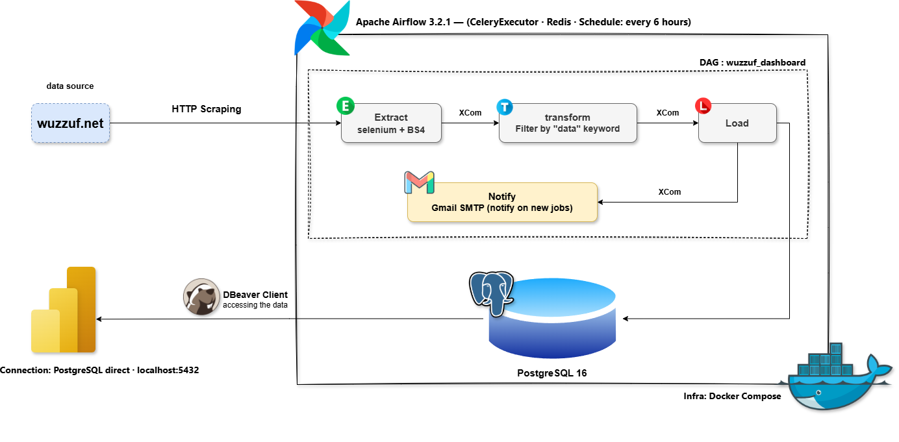
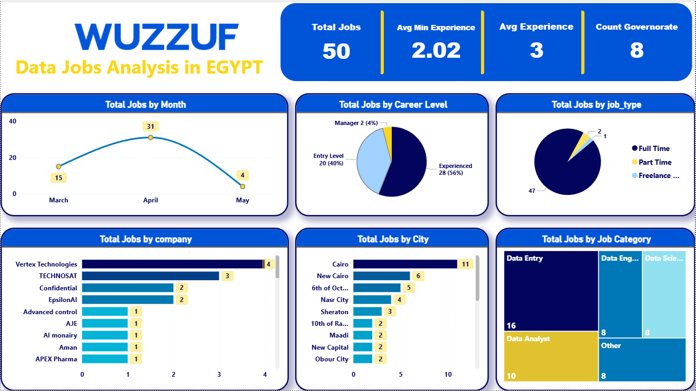

# wuzzuf-etl-pipeline
An automated ETL pipeline that scrapes data jobs from Wuzzuf.net, stores them in PostgreSQL, and visualizes insights on Power BI.

# Wuzzuf Data Jobs Pipeline 🚀

An automated ETL pipeline that scrapes data jobs from Wuzzuf.net,
stores them in PostgreSQL, and visualizes insights on Power BI.

## Architecture

## Dashboard

## Tech Stack
- Apache Airflow 3.2.1
- Selenium + BeautifulSoup
- PostgreSQL 16
- Power BI Desktop
- Docker Compose
- Python

## How to Run

### 1. Clone the repo
git clone https://github.com/ahmed-mo505/wuzzuf-etl-pipeline.git

### 2. Setup environment
cp .env.example .env
# Edit .env with your credentials

### 3. Build and run
docker compose build
docker compose up -d

### 4. Access Airflow
http://localhost:8085
Username: airflow
Password: airflow

### 5. Enable DAG
- wuzzuf_dashboard: runs every 6 hours
  - Scrapes data jobs from Egypt
  - Stores new jobs in PostgreSQL
  - Sends email notification on new jobs
  - Powers the Power BI dashboard
